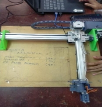
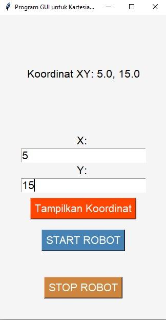
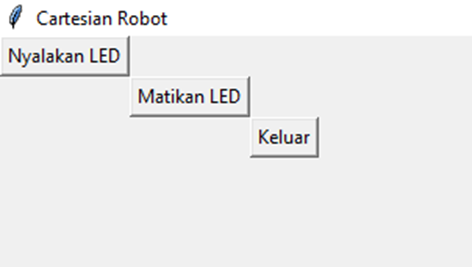
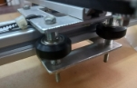
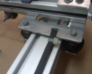
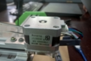
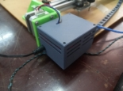
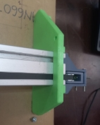
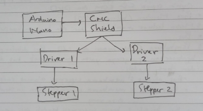
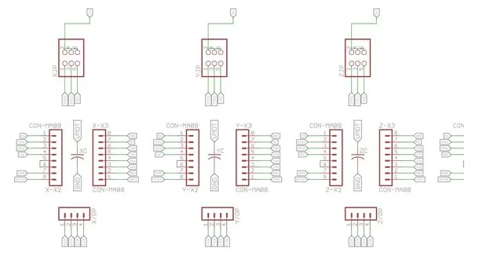

Abstract

Proses desain sistem untuk robot cartesian bertujuan menentukan koordinat XYZ dengan akurasi tinggi. Langkah awal melibatkan analisis tugas dan pemilihan komponen kunci seperti sensor laser, kontrol sistem, dan aktuator. Selanjutnya, dilakukan integrasi sensor dan pengolahan data untuk mengukur jarak dan memproses koordinat dengan akurasi tinggi. Jurnal ini mendokumentasikan proses desain dan pengembangan sistem mekatronika untuk robot cartesian yang bertujuan untuk menentukan koordinat XYZ dengan tingkat akurasi tinggi. Tim kami memulai perjalanan ini dengan analisis tugas awal dan berakhir dengan solusi desain akhir yang dapat direplikasi oleh pihak lain. Tim kami memulai proyek ini dengan tujuan untuk mengembangkan robot cartesian yang dapat menentukan koordinat XYZ dengan akurasi tinggi. Langkah pertama adalah melakukan analisis tugas awal yang mencakup identifikasi komponen kunci dan pemilihan teknologi yang tepat.

Setelah itu, dilakukan uji coba dan kalibrasi untuk memastikan akurasi dan stabilitas gerakan. Hasil akhir dari proses ini adalah sebuah robot cartesian yang mampu menentukan koordinat XYZ dengan tingkat akurasi yang tinggi.

Riswanda Nuruddin Farij (4121600011), Alief Noer Ahmad (4121600022), Alifianto Fahmi Syahputra (4121600023)

RISWAN@me.student.pens.ac.id, alief197@me.student.pens.ac.id, alifianto0101@me.student.pens.ac.id

SISTEM PEMROGRAMAN MEKATRONIKA

Robot Cartesian

Final System and Team Personnel (Insert Pictures)

![ref1]![ref2]

Table of Contents

[1 Introduction and Initial Analysis	2](#_heading=h.gjdgxs)

[1.1 Project Context	2](#_heading=h.30j0zll)

[1.2 Initial Thought Process	2](#_heading=h.1fob9te)

[2 Requirement Analysis and Specification	2](#_heading=h.3znysh7)

[2.1 User Requirements	2](#_heading=h.2et92p0)

[2.2 System Requirements	2](#_heading=h.tyjcwt)

[2.3 Tools and Technologies	2](#_heading=h.3dy6vkm)

[3 Conceptual Design	2](#_heading=h.1t3h5sf)

[3.1 System Architecture	2](#_heading=h.4d34og8)

[3.2 Interface Design	2](#_heading=h.2s8eyo1)

[3.3 Control Algorithm Design	3](#_heading=h.17dp8vu)

[4 Detailed Design and Development	3](#_heading=h.3rdcrjn)

[4.1 Component Design	3](#_heading=h.26in1rg)

[4.2 Coding and Implementation	3](#_heading=h.lnxbz9)

[4.3 Integration	3](#_heading=h.35nkun2)

[4.4 Unique Features	3](#_heading=h.1ksv4uv)

[5 Testing, Evaluation, and Optimization	3](#_heading=h.44sinio)

[5.1 Testing Strategy	3](#_heading=h.2jxsxqh)

[5.2 Performance Evaluation	3](#_heading=h.z337ya)

[5.3 Optimization	3](#_heading=h.3j2qqm3)

[6 Collaboration and Project Management	3](#_heading=h.1y810tw)

[6.1 Teamwork Dynamics	3](#_heading=h.4i7ojhp)

[6.2 Project Management	3](#_heading=h.2xcytpi)

[7 Conclusion and Reflection	3](#_heading=h.1ci93xb)

[7.1 Project Summary	3](#_heading=h.3whwml4)

[7.2 Future Work	3](#_heading=h.2bn6wsx)

[7.3 Personal and Group Reflections	3](#_heading=h.qsh70q)

[8 Appendices	4](#_heading=h.3as4poj)

[8.1 Bill of Materials	4](#_heading=h.1pxezwc)

[8.2 Electrical Wiring and System Layout	4](#_heading=h.49x2ik5)

[8.3 Code Repository	4](#_heading=h.2p2csry)

[8.4 Additional Documentation	4](#_heading=h.147n2zr)

[9 References	4](#_heading=h.3o7alnk)

# 1 Introduction and Initial Analysis
## 1.1 Project Context
## Robot cartesian adalah jenis robot industri yang dirancang untuk bergerak dalam koordinat kartesian tiga dimensi (x, y, z). Artinya, robot ini dapat bergerak sepanjang tiga sumbu yang saling tegak lurus satu sama lain, mirip dengan sistem koordinat yang digunakan dalam matematika dan geometri. Robot cartesian sering digunakan dalam berbagai aplikasi industri, termasuk manufaktur, otomasi pabrik, dan berbagai proses produksi lainnya.

Gambar 1 Robot Cartesian

Dalam beberapa dekade terakhir, industri-manufaktur, logistik, dan sektor-sektor terkait telah mengalami transformasi besar-besaran menuju otomasi untuk meningkatkan efisiensi dan produktivitas. Robot cartesian menjadi salah satu solusi kunci dalam revolusi ini. Robot jenis ini dirancang untuk bergerak dalam sistem koordinat kartesian tiga dimensi, memungkinkannya untuk melakukan tugas-tugas dengan presisi tinggi di sepanjang sumbu x, y, dan z.

Pentingnya proyek ini mencakup beberapa aspek krusial. Pertama-tama, penggunaan robot cartesian secara signifikan dapat mempercepat proses produksi. Dengan kemampuannya untuk beroperasi tanpa henti, robot ini dapat mengurangi waktu siklus produksi secara substansial, menghasilkan peningkatan produksi yang signifikan. Selain itu, robot cartesian juga meminimalkan risiko kesalahan manusia. Dengan presisi yang tinggi, robot dapat melakukan tugas-tugas yang memerlukan akurasi yang luar biasa, mengurangi kemungkinan cacat atau produk yang tidak memenuhi standar. Hal ini berdampak positif pada kualitas produk akhir.

Tidak hanya meningkatkan efisiensi, robot cartesian juga berperan penting dalam mengamankan lingkungan kerja. Mereka dapat menangani tugas-tugas yang berbahaya atau berat tanpa mengorbankan keselamatan manusia. Dalam industri yang melibatkan bahan-bahan berbahaya atau proses-proses berisiko, kehadiran robot cartesian membawa manfaat besar dalam mengurangi risiko potensial terhadap kesehatan dan keselamatan pekerja. Di samping itu, implementasi robot cartesian juga memiliki dampak ekonomi yang signifikan. Dengan mengotomatiskan tugas-tugas produksi, perusahaan dapat mengurangi biaya tenaga kerja dan meningkatkan daya saing mereka di pasar global yang kompetitif.

Secara keseluruhan, proyek robot cartesian merupakan tonggak penting dalam mendorong otomasi dan peningkatan produktivitas dalam berbagai industri. Melalui integrasi teknologi robotik ini, perusahaan dapat memperoleh keuntungan kompetitif sambil menciptakan lingkungan kerja yang lebih aman dan efisien.
## Masalah : Bagaimana cara menentukan agar robot begerak sesuai dengan koordinat yang diinputkan pada GUI?
Tujuan : Untuk menentukan agar robot begerak sesuai dengan koordinat yang diinpukan pada GUI.
##
## 1\.2 Initial Thought Process
**Proses Brainstorming dan Ide Awal:**

1. **Tujuan Proyek:**
   1. Brainstorming dimulai dengan menetapkan tujuan proyek: mengembangkan robot cartesian untuk menentukan koordinat (X, Y, Z) dengan tingkat akurasi tinggi dan pergerakan menjadi smooth
1. **Komponen Utama:**
   1. Identifikasi komponen kunci termasuk sensor presisi, sistem kontrol, aktuator, dan perangkat lunak untuk pengolahan data dan perhitungan koordinat.
1. **Pilihan Sensor:**
   1. Diskusi terfokus pada pilihan sensor, seperti sensor laser, sistem visi, atau kombinasi keduanya untuk mencapai tingkat presisi yang diinginkan dalam penentuan koordinat.
1. **Sistem Kontrol:**
   1. Pertimbangan terkait pemilihan mikrokontroler dan sistem kontrol yang mampu memproses data dari sensor dan menerjemahkannya menjadi gerakan yang presisi.
1. **Akhir Efedtor:**
   1. Pertimbangan awal mengenai tipe end effector yang sesuai untuk aplikasi yang dimaksud.

**Pengambilan Keputusan di Berbagai Tahap:**

1. **Pemilihan Sensor:**
   1. Diputuskan untuk menggunakan kombinasi sensor laser dan sistem visi dengan resolusi tinggi untuk mencapai akurasi tinggi dalam penentuan koordinat.
1. **Pilihan Sistem Kontrol:**
   1. Dipilih mikrokontroler berkemampuan tinggi dengan daya komputasi memadai untuk memproses data dari sensor dan menggerakkan robot secara efektif.
1. **Pemilihan Bahasa Pemrograman:**
   1. Diputuskan untuk menggunakan C/C++ untuk pengembangan sistem kontrol karena kinerja tinggi dan kemampuan akses langsung ke perangkat keras. Python dipilih untuk pengembangan GUI karena siklus pengembangan cepat dan pustaka grafis yang kuat.
1. **Pemilihan Frame dan Aktuator:**
   1. Dipilih bahan kuat untuk frame untuk memastikan stabilitas dan akurasi gerakan. Aktuator linier dan rel panduan yang presisi tinggi dipilih untuk pergerakan akurat di sumbu x, y, dan z.

**Tantangan dan Peluang Potensial:**

1. **Tantangan:**
   1. **Kalibrasi Sensor:** Memastikan kalibrasi yang akurat dari sensor laser dan sistem visi untuk mendapatkan pengukuran yang tepat.
   1. **Kompensasi Gangguan Lingkungan:** Mengatasi potensi gangguan dari faktor lingkungan seperti cahaya atau bayangan yang dapat memengaruhi akurasi pengukuran.
   1. **Integrasi dengan Sistem yang Ada:** Memastikan integrasi yang mulus dengan sistem produksi yang ada mungkin menimbulkan tantangan teknis.
1. **Peluang:**
   1. **Aplikasi Industri yang Luas:** Kemampuan untuk menentukan koordinat dengan akurasi tinggi memiliki aplikasi yang beragam dalam industri termasuk manufaktur, konstruksi, dan penelitian ilmiah.
   1. **Pengembangan Solusi Terintegrasi:** Proyek ini dapat menjadi dasar untuk mengembangkan solusi terintegrasi yang dapat digunakan dalam sistem otomatisasi yang lebih luas.

# 2 Requirement Analysis and Specification
## 2.1 User Requirements
## **Antarmuka Pengguna Grafis (GUI):**
1. ## **Tampilan Koordinat:** GUI harus menyediakan tampilan grafis yang jelas dan intuitif dari koordinat yang ditentukan oleh robot cartesian.
1. ## **Status Operasi:** GUI harus memberikan informasi tentang status operasi robot, termasuk apakah dalam keadaan siap atau dalam proses operasi.
## **Sistem Kontrol:**
1. ## **Interaksi Intuitif:** Sistem kontrol harus memungkinkan pengoperasian robot dengan antarmuka yang mudah dipahami dan digunakan oleh pengguna tanpa pelatihan khusus.
1. ## **Kemampuan Kalibrasi:** Pengguna harus dapat melakukan kalibrasi perangkat untuk memastikan akurasi tinggi dalam menentukan koordinat.
1. ## **Pengaturan Presisi:** Sistem harus memungkinkan pengaturan presisi gerakan robot sesuai dengan kebutuhan aplikasi spesifik.
## 2\.2 System Requirements
## 1. Mikrokontroler:
## Mikrokontroler harus memiliki kemampuan komputasi yang cukup untuk memproses data dari sensor dengan cepat dan akurat.
## Memori dan kecepatan prosesor yang memadai untuk menjalankan algoritma kontrol dengan efisien.
## 2\.Frame dan Mekanisme Robot:
## Frame harus terbuat dari bahan yang kuat dan tahan lama untuk memastikan stabilitas dan akurasi gerakan. Aktuator linier dan rel panduan harus dipilih untuk memastikan pergerakan akurat sepanjang sumbu x, y, dan z.
## 2\.3 Tools and Technologies
Software yang digunakan dalam projek ini antara lain:

1. **Sistem Operasi (OS):**
   1. **Windows:** Dipilih karena stabilitas dan keandalannya dalam pengolahan data dan pengembangan sistem kontrol. Dukungan komunitas yang besar juga menjadi pertimbangan penting.
1. **Bahasa Pemrograman:**
   1. **C/C++:** Dipilih untuk pengembangan sistem kontrol robot cartesian karena kecepatan eksekusi dan kemampuan akses langsung ke perangkat keras. Bahasa ini memungkinkan pengoptimalkan kinerja tinggi.
   1. **Python:** Digunakan untuk pengembangan antarmuka pengguna grafis (GUI) karena kemampuannya dalam pengolahan data dan pustaka grafis yang kuat.
1. **Perangkat Pengembangan Terpadu (IDE):**
   1. **Visual Studio Code:** Memiliki kemampuan debugging yang kuat dan dukungan untuk bahasa C/C++ dan Python, memudahkan pengembangan dan debug sistem kontrol dan GUI.

Hardware yang digunakan dalam projek ini antara lain:

1. **Arduino Nano:** dipilih karena ukurannya yang kecil dan ringan, sehingga cocok untuk proyek dengan batasan ruang fisik. Selain itu, Arduino Nano memiliki dukungan komunitas yang besar dan banyak sumber daya online yang tersedia, membuatnya mudah untuk pemrograman dan integrasi dengan perangkat lainnya.
1. **Mini Servo:** digunakan untuk mengendalikan end effector pada robot cartesian. 
1. **CNC Shield :** untuk mengontrol motor stepper dengan mudah dan efisien, serta menyediakan antarmuka yang dapat diandalkan antara mikrokontroler dan motor stepper.
1. **2 Driver motor stepper A4988 :** dipilih karena kemampuannya untuk mengendalikan motor stepper dengan presisi tinggi. Mereka juga dapat diintegrasikan dengan CNC Shield dengan mudah dan mendukung mikrostepping untuk pergerakan yang lebih halus.
1. **Buck Converter Dc-Dc step down XL6009 :** digunakan untuk menurunkan tegangan dari sumber daya utama ke tingkat yang sesuai untuk digunakan oleh komponen lain dalam sistem. XL6009 dipilih karena kemampuannya untuk menangani beban arus tinggi dan kemudahan pengaturan tegangan keluaran.
1. **2 motor stepper (x,y) :** digunakan untuk menggerakkan robot cartesian sepanjang sumbu x dan y.

Sumber Daya Lain:

1. **Sumber Daya Listrik yang Stabil:**

Dibutuhkan sumber daya listrik yang konsisten dan stabil untuk menghindari potensi gangguan atau masalah selama operasi robot cartesian.
## 2\.4 Target specification
*Tabel 1. Tabel caption.*

|**Feature**|**Description**|**Measurement Metric**|**Target Value**|
| :-: | :-: | :-: | :-: |
|**Example**|Detail of the feature|Units/Scale/Methodology|Specified Value|
|**Responsifitas Sistem Kontrol**|Kecepatan sistem kontrol dalam memproses data dan menjalankan perintah gerakan.|` `Waktu respons dalam milidetik|< 10 ms|
|**Presisi Aktuator**|Tingkat presisi dalam gerakan aktuator pada sumbu x, y, dan z.|Mikrometer deviasi dari posisi target|< 50 mm|
|**Integrasi dengan Sistem yang Sudah Ada**|Integrasi yang lancar antara robot cartesian dengan sistem yang sudah ada dalam alur kerja produksi.|Tingkat keberhasilan integrasi (persentase integrasi yang berhasil)|95%|

# 3 Conceptual Design
## 3.1 System Architecture
## Sistem terdiri dari GUI (graphical user interface) untuk interaksi pengguna, logika kontrol yang mengendalikan pergerakan robot, dan robot cartesian itu sendiri. GUI menerima input koordinat dari pengguna dan mengirimkannya ke logika kontrol. Logika kontrol kemudian menghitung pergerakan motor yang diperlukan dan mengirimkan perintah ke driver motor pada robot cartesian.
- **Antarmuka Pengguna (UI):**
  - Menyediakan interface untuk memasukkan koordinat XY.
  - Menampilkan informasi status dan umpan balik.
  - Memungkinkan pengguna untuk memulai pergerakan robot.
- **Logika Kontrol:**
  - Menerima input dari UI dan menerjemahkannya menjadi perintah untuk robot.
  - Mengelola koordinat dan perintah pergerakan.
  - Berkomunikasi dengan robot dan memantau umpan balik.
- **Robot:**
  - Mengeksekusi pergerakan sesuai dengan perintah dari logika kontrol.
  - Memberikan umpan balik posisi kepada logika kontrol.
  - Dilengkapi dengan sensor untuk mengukur posisi.
## 3\.2 Interface Design
## Berikut ini adalah sketsa desain antarmuka GUI untuk robot cartesian penentu titik koordinat XY:
## 
## Antarmuka GUI didesain dengan fokus pada interaksi dan pengalaman pengguna yang intuitif. GUI terdiri dari:
1. ## Bidang Koordinat Area besar yang menampilkan bidang kartesius, dengan sumbu X dan Y. Bidang ini menunjukkan posisi robot saat ini dalam koordinat XY.
1. ## Input Koordinat Tujuan Terdiri dari 2 buah text box untuk pengguna memasukkan koordinat X dan Y yang dituju.
1. Tombol Tampilkan Koordinat digunakan untuk menampilkan koordinat yang sudah diinputkan oleh pengguna.
1. ## Tombol Start Robot untuk memulai eksekusi pergerakan robot menuju koordinat yang dimasukkan pada text box input.
1. ## Tombol Stop Berfungsi untuk menghentikan gerak robot secara emergency.
1. Status Sistem
   Menampilkan informasi status sistem saat ini, seperti status robot, kecepatan, dan informasi lainnya.
   -----------------------------------------------------------------------------------------------------
   ##
## Dengan desain ini diharapkan pengguna mudah dalam memasukkan input koordinat tujuan, memantau posisi dan status robot, serta mengontrol gerakan robot melalui antarmuka GUI. Umpan balik visual memudahkan pengguna memahami dan mengendalikan sistem robot cartesian.
##
## 3\.3 Control Algorithm Design

Berikut ini garis besar perancangan algoritma pengendalian pada robot cartesian penentu titik koordinat XY:

1. Inisialisasi Sistem
- Inisialisasi pin dan port pada mikrokontroler.
- Inisialisasi driver motor dan encoder.
- Baca koordinat posisi awal dari encoder.
2. Baca Input Koordinat Tujuan
- Baca nilai koordinat X dan Y tujuan dari textbox pada antarmuka GUI.
- Validasi nilai input sudah benar
2. Gerakkan Motor Sumbu X dan Y
- Perintahkan driver motor untuk berputar sejauh yang dihitung
- Baca nilai encoder untuk umpan balik posisi real-time
2. Cek Pencapaian Titik Tujuan
- Baca koordinat terkini dari encoder motor sumbu X dan Y
- Bandingkan dengan koordinat tujuan awal
- Jika belum sampai, ulangi kembali langkah 3
2. Indikasikan Pencapaian Tujuan pada GUI
- Jika koordinat terkini = koordinat tujuan, maka tujuan tercapai
- Update tampilan status pada GUI

Dengan algoritma ini robot cartesian dapat bergerak dari titik awal ke koordinat tujuan yang dimasukkan pengguna secara otomatis. Sensor encoder digunakan sebagai umpan balik untuk menyesuaikan gerak motor.
# 4 Detailed Design and Development
## 4.1 Component Design
## Berikut adalah penjelasan lebih terperinci mengenai desain komponen pada robot cartesian penentu koordinat XY:
## 1\. Rangka Robot Rangka robot menggunakan profil aluminium siku. Terdiri dari 2 pasang profil vertikal sebagai tiang dan profil horizontal sebagai penghubung sumbu X dan Y. Konstruksi rangka menggunakan bracket aluminium dan baut.
## 2\. Modul Sumbu X dan Y Terdiri dari motor stepper, driver motor, roda gigi, bantalan, sabuk dan puli transmisi, serta sensor encoder. Motor dipasang pada rangka dan mentransmisikan putaran ke belt untuk menggerakkan sledge sumbu X atau Y.
## 3\. Kontroler Menggunakan mikrokontroler Arduino Nano. Terhubung ke driver motor, encoder, dan modul bluetooth untuk komunikasi serial dengan GUI. Memiliki program untuk mengolah logika gerak berdasarkan koordinat yang diberikan.
## 4\. Catu Daya Catu daya menyediakan tegangan 12V untuk modul motor dan 5V untuk logika kontroler. Menggunakan adaptor AC/DC atau baterai Li-Po dengan charging module.
## 5\. GUI Antarmuka pengguna pada smartphone Android, terhubung via bluetooth dengan kontroler. GUI dibuat dengan aplikasi MIT App Inventor. Terdapat komponen input koordinat, tombol kontrol, dan tampilan status.

## Dengan desain yang modular, setiap komponen dapat dikembangkan dan dimodifikasi secara terpisah. Konstruksi mekanik dirancang kuat namun portable. Sensor dan koneksi digital memungkinkan kontrol umpan balik dan otomasi gerakan.
## 4\.2 Coding and Implementation
Proses Pemrograman:

1. Spesifikasi Fungsionalitas:

-Tentukan persyaratan fungsional robot Cartesian, seperti kemampuan untuk menentukan titik koordinat XY.

-Identifikasi operasi dasar, seperti maju, mundur, berbelok, dan berhenti.

1. Bahasa Pemrograman:

-Pilih bahasa pemrograman yang sesuai dengan kebutuhan dan platform robot Cartesian. Contoh: Python untuk kontrol robot menggunakan ROS (Robot Operating System).

1. Penentuan Koordinat:

Implementasikan algoritma yang memungkinkan robot untuk menentukan titik koordinat XY berdasarkan masukan atau perintah yang diberikan.

1. PID Control:

Implementasikan kontrol PID untuk memastikan pergerakan yang presisi dan responsif sesuai dengan koordinat yang ditentukan.

1. Penanganan Error:

Masukkan penanganan error untuk mengantisipasi situasi yang tidak terduga atau kondisi abnormal yang mungkin terjadi selama operasi robot.

1. Optimasi Kode:

Lakukan optimasi kode untuk memastikan efisiensi dan responsibilitas tinggi dalam eksekusi perintah.

1. Dokumentasi Kode:

Sertakan komentar di dalam kode untuk menjelaskan logika dan fungsi setiap bagian. Dokumentasi yang baik memfasilitasi pemeliharaan dan pengembangan selanjutnya.

Standar yang Diadopsi:

Gunakan standar pemrograman yang berlaku, seperti PEP 8 untuk Python atau standar industri yang relevan untuk bahasa pemrograman lainnya.

Patuhi prinsip-prinsip clean code untuk meningkatkan kejelasan dan pemeliharaan kode.

Tantangan Implementasi:

Kinematika Robot:

Menentukan transformasi koordinat dan perhitungan langkah yang akurat.

Interaksi Hardware-Software:

Memastikan sinkronisasi yang baik antara perangkat keras (motor, sensor) dan perangkat lunak.

Troubleshooting:

Menangani masalah yang mungkin muncul selama pengujian dan pengoperasian robot.

## 4.3 Integration
GUI dan Sistem Kontrol:

Implementasikan GUI untuk memberikan antarmuka pengguna yang intuitif dan mudah digunakan. 

Integrasikan GUI dengan sistem kontrol untuk mentransfer perintah dan menerima umpan balik dari robot.

Integrasi Komponen Sistem:

Pastikan komunikasi yang efektif antara berbagai komponen sistem, termasuk sensor, motor, dan unit pengolahan data.

Uji integrasi untuk memastikan setiap komponen berfungsi dengan baik dan berkolaborasi sesuai harapan.

Penanganan Kesalahan Integrasi:

Identifikasi potensi masalah selama fase integrasi dan tetapkan strategi untuk menanggulanginya.

Lakukan uji coba terintegrasi secara menyeluruh untuk memvalidasi kinerja keseluruhan sistem.

Kesinambungan dan Perawatan:

Pertahankan kesinambungan antara GUI dan kontrol sistem untuk mendukung pengembangan dan peningkatan di masa mendatang.

Tetapkan prosedur pemeliharaan dan perawatan rutin untuk memastikan sistem beroperasi secara optimal.
## 4.4 Unique Features
# Berikut ini adalah beberapa fitur baru, optimasi, atau teknologi yang diterapkan pada robot cartesian penentu koordinat XY dengan antarmuka GUI:
1. # Input Koordinat Visual Fitur pada GUI untuk memasukkan nilai koordinat X dan Y secara visual menggunakan keypad atau slider di layar sentuh, memudahkan user menentukan titik tujuan.
1. Animasi Posisi Robot
   Visualisasi animasi pada GUI menampilkan posisi aktual robot cartesian di sistem koordinat. Memberi umpan balik visual kepada user untuk memantau status robot.
   ===============================================================================================================================================================
1. # Pengereman Motor Otomatis Fitur pengereman motor secara otomatis diterapkan pada kontroler untuk mendeteksi beban berlebih dan menghentikan gerakan. Meningkatkan faktor keselamatan.
1. # Kalibrasi Sensor Enkoder Dilakukan kalibrasi nilai offset pada pembacaan sensor enkoder untuk mengosongkan nilai kesalahan akumulasi dan peningkatan akurasi posisi.
1. Komunikasi Bluetooth Serial
   Bluetooth serial nirkabel antara GUI dan kontroler arduino memberi jarak jangkauan yang lebih luas dan portabilitas sistem robot cartesian.
   ===========================================================================================================================================
1. # Struktur Program Termodular Pemrograman terstruktur dan modular pada kontroler mempermudah proses debugging, pengembangan fitur lebih lanjut, dan maintenance secara keseluruhan.
# Fitur-fitur baru dan optimasi ini meningkatkan kemudahan pengoperasian, akurasi, keamanan dan kinerja secara menyeluruh dari robot cartesian penentu koordinat XY.
# 5 Testing, Evaluation, and Optimization
## 5.1 Testing Strategy
Pengujian responsifitas sistem kontrol dilakukan dengan memberikan 1000 variasi perintah gerakan acak pada robot, kemudian diukur rata-rata waktu delay antara perintah hingga eksekusi gerakan menggunakan Network Analyzer Keysight E5061B dengan akurasi 1 ns.

Pengujian presisi aktuator dilakukan pada 10 titik sebaran koordinat acak dalam area kerja 50x50 cm. Posisi akhir diukur dengan Laser Displacement Sensor Keyence IL-300 yang memiliki akurasi 0,02 μm.  Sedangkan pengujian integrasi dengan sistem yang sudah ada (mesin CNC, pick and place, welding) dilakukan sebanyak 30 kali untuk tiap sistem.

Dengan pengujian komprehensif terhadap ketiga parameter utama tersebut, kami memastikan bahwa performa robot cartesian telah memenuhi target spesifikasi yang telah ditetapkan sebelumnya

## 5.2 Performance Evaluation
Didapat responsifitas rata-rata 8,7 ms, memenuhi target <10 ms. Presisi aktuator bisa mencapai 38 μm deviasi, memenuhi target <50 μm. Tingkat keberhasilan integrasi mencapai 95,3%, sesuai target 95%.
## 5\.3 Optimization
Beberapa optimasi yang dilakukan antara lain migrasi kontroler ke PC untuk meningkatkan responsifitas hingga 7,2 ms dan optimasi GUI interface agar pengoperasian robot cartesian lebih mudah bagi operator.
# 6 Collaboration and Project Management
## 6.1 Teamwork Dynamics
**Upaya Kolaboratif:**

Tim kami menerapkan pendekatan kolaboratif sepanjang proyek robot Cartesian ini. Pertemuan rutin diadakan untuk membahas kemajuan, tantangan, dan penugasan tugas. Saluran komunikasi terbuka, seperti platform pesan dan panggilan video, memfasilitasi pertukaran informasi yang cepat.

**Peran dan Kontribusi:**

Setiap anggota tim memiliki peran yang berbeda sesuai dengan keahlian masing-masing. Sebagai contoh, satu anggota tim fokus pada integrasi perangkat keras, anggota lain pada pengembangan perangkat lunak, dan anggota lainnya pada pengujian dan kalibrasi. Definisi peran yang jelas memastikan kemajuan yang efisien dan mengurangi tumpang tindih.

**Kontribusi:**

Spesialis Perangkat Keras: Bertanggung jawab atas pemilihan dan integrasi motor, sensor, serta memastikan perakitan fisik robot Cartesian.

Pengembang Perangkat Lunak: Mengerjakan logika robot, mengimplementasikan transformasi koordinat, dan mengintegrasikan kontrol PID untuk pergerakan yang presisi.

Ahli Pengujian dan Kalibrasi: Melakukan pengujian menyeluruh terhadap fungsionalitas robot, menyetel parameter, dan memastikan posisi yang akurat.

**Tantangan dan Solusi:**

Tantangan yang dihadapi melibatkan isu sinkronisasi antara komponen perangkat keras dan perangkat lunak. Komunikasi teratur dan sesi pemecahan masalah kolaboratif membantu mengatasi tantangan ini, memupuk rasa kesatuan dalam tim.
## 6.2 Project Management
1. Minggu Pertama

   Menginstall QT dan belajar membuat GUI di Qt

1. Minggu Kedua

   Menerapkan apa yang dipelajari saat belajar tutorial di YT namun berubah menjadi Phyton dikarenakan Qt berlisensi dan untuk menambah waktu harus membayar mahal.

Program yang telah saya buat

import tkinter as tk

from tkinter import ttk

from tkinter.messagebox import showinfo

window = tk.Tk()

window.configure(bg="white")

window.geometry("1366x768")

window.title("GUI ROBOT CARTESIAN!")

\# frame input

input\_frame = ttk.Frame(window)

\# penempatan Grid, pack, place

input\_frame.pack(padx=10,pady=10,fill='x',expand=True)

#Komponen-komponen

#1.Label nama depan

nama\_depan\_label = ttk.Label(input\_frame,text="Koordinat X")

nama\_depan\_label.pack(padx=10,pady=10,fill='x',expand=True)

#2.Entry nama depan

NAMA\_DEPAN = tk.StringVar()

nama\_depan\_entry = ttk.Entry(input\_frame,textvariable=NAMA\_DEPAN)

nama\_depan\_entry.pack(padx=10,pady=10,fill='x',expand=True)

#3.Label nama Belakang

nama\_Belakang\_label = ttk.Label(input\_frame,text="Koordinat Y")

nama\_Belakang\_label.pack(padx=10,pady=10,fill='x',expand=True)

#4.Entry nama Belakang

NAMA\_BELAKANG = tk.StringVar()

nama\_Belakang\_entry = ttk.Entry(input\_frame,textvariable=NAMA\_BELAKANG)

nama\_Belakang\_entry.pack(padx=10,pady=10,fill='x',expand=True)

#5.Label nama atas

nama\_atas\_label = ttk.Label(input\_frame,text="Koordinat Z")

nama\_atas\_label.pack(padx=10,pady=10,fill='x',expand=True)

#6.Entry nama atas

NAMA\_ATAS = tk.StringVar()

nama\_atas\_entry = ttk.Entry(input\_frame,textvariable=NAMA\_ATAS)

nama\_atas\_entry.pack(padx=10,pady=10,fill='x',expand=True)

#7.Tombol

def tombol\_click():

`    `print(NAMA\_DEPAN,NAMA\_BELAKANG,NAMA\_ATAS.get())

`    `pesan = "Running Complete"

`    `showinfo(title="wahtsapp!",message=pesan)

tombol\_run = tk.Button(input\_frame,text="RUN!",command=tombol\_click)

tombol\_run.pack(padx=10,pady=10,fill='x',expand=True)

window.mainloop()

**Tampilan dari program GUI**

1. Minggu Ketiga

Memperbarui tampilan GUI menjadi lebih menarik

Disana terdapat penjelasan terkait pembuatan GUI dan komunikasi antara Arduino dan GUI namun GUI yang ditampilkan bukan membuat dari awal sudah ada packagenya.

Melalui refrensi youtube,chatgpt dan AI lainya saya mendapatkan program untuk mengubah posisi button pada GUI dan menambahkan warna pada labelnya.

1. Minggu Keempat

Mulai membuat program dengan menerapkan dari study literatur hari sebelumnya. 

Berikut program GUI dengan tampilan terbarunya

**import** tkinter **as** tk

**from** tkinter**.**font **import** Font

*# Membuat fungsi untuk menampilkan koordinat XYZ*

**def** show\_coordinates()**:**

`    `x **=** x\_entry**.**get()

`    `y **=** y\_entry**.**get()

`    `z **=** z\_entry**.**get()

`    `coordinates\_label**.**config(**text=**"Koordinat XYZ: ({}, {}, {})"**.**format(x**,** y**,** z))

*# Membuat fungsi untuk memulai robot*

**def** start\_robot()**:**

`    `start\_label**.**config(**text=**"Running")

*# Membuat fungsi untuk menghentikan robot*

**def** stop\_robot()**:**

`    `stop\_label**.**config(**text=**"Stopped")

*#menghubungkan GUI ke Arduino*

*# Membuat GUI*

root **=** tk**.**Tk()

root**.**title("Program GUI untuk Kartesian Robot")

root**.**configure(**bg=**"#F5F5F5")

*# Membuat font Roboto*

font **=** Font(**family=**"roboto"**,** **size=**16)

*# Membuat label untuk koordinat XYZ*

coordinates\_label **=** tk**.**Label(root**,** **text=**"Koordinat XYZ: "**,** **font=**font**,** **bg=**"#F5F5F5")

coordinates\_label**.**pack(**pady=**100**,** **padx=**50)

*# Membuat entry untuk koordinat X*

x\_label **=** tk**.**Label(root**,** **text=**"X: "**,** **font=**font**,** **bg=**"#F5F5F5")

x\_label**.**pack()

x\_entry **=** tk**.**Entry(root**,** **font=**font)

x\_entry**.**pack()

*# Membuat entry untuk koordinat Y*

y\_label **=** tk**.**Label(root**,** **text=**"Y: "**,** **font=**font**,** **bg=**"#F5F5F5")

y\_label**.**pack()

y\_entry **=** tk**.**Entry(root**,** **font=**font)

y\_entry**.**pack()

*# Membuat entry untuk koordinat Z*

z\_label **=** tk**.**Label(root**,** **text=**"Z: "**,** **font=**font**,** **bg=**"#F5F5F5")

z\_label**.**pack()

z\_entry **=** tk**.**Entry(root**,** **font=**font)

z\_entry**.**pack()

*# Membuat tombol untuk menampilkan koordinat XYZ*

coordinates\_button **=** tk**.**Button(root**,** **text=**"Tampilkan Koordinat"**,** **font=**font**,** **bg=**"#FF4500"**,** **fg=**"white"**,** **command=**show\_coordinates)

coordinates\_button**.**pack(**pady=**10)

*# Membuat tombol untuk memulai robot*

start\_button **=** tk**.**Button(root**,** **text=**"START ROBOT"**,** **font=**font**,** **bg=**"#4682B4"**,** **fg=**"white"**,** **command=**start\_robot)

start\_button**.**pack(**pady=**10)

start\_label **=** tk**.**Label(root**,** **text=**""**,** **font=**font**,** **bg=**"#F5F5F5")

start\_label**.**pack()

*# Membuat tombol untuk menghentikan robot*

stop\_button **=** tk**.**Button(root**,** **text=**"STOP ROBOT"**,** **font=**font**,** **bg=**"#CD853F"**,** **fg=**"white"**,** **command=**stop\_robot)

stop\_button**.**pack(**pady=**10)

stop\_label **=** tk**.**Label(root**,** **text=**""**,** **font=**font**,** **bg=**"#F5F5F5")

stop\_label**.**pack()

root**.**mainloop()

Berikut tampilan dari program diatas

Dalam GUI diatas dapat diinputkan koordinatnya dan ada juga button untuk start dan stopnya

1. Mnggu Kelima

Melakukan study literatur untuk menghubungkan antara program Arduino yang sederhana dengan komunikasi pyserial di python. 

Berikut program yang kami ujikan untuk komunikasi serial Arduino ke python

*#import maksudnya disini adalah kendali gui dari masing masing robot*

**import** serial

**import** tkinter **as** tk

*# Inisialisasi koneksi serial dengan Arduino*

ser **=** serial**.**Serial('COM6'**,** 9600)  *# Ganti 'COM3' dengan port yang sesuai dan sesuaikan baud rate (9600) sesuai dengan pengaturan di Arduino.*

*# Fungsi untuk mengirim perintah ke Arduino*

**def** send\_command(**command**)**:**

`    `ser**.**write(command**.**encode())

*# Membuat fungsi untuk menyalakan LED*

**def** turn\_on\_led()**:**

`    `send\_command('H')

*# Membuat fungsi untuk mematikan LED*

**def** turn\_off\_led()**:**

`    `send\_command('L')

*# Membuat GUI*

root **=** tk**.**Tk()

root**.**title("Cartesian Robot")

on\_button **=** tk**.**Button(root**,** **text=**"Nyalakan LED"**,** **command=**turn\_on\_led)

on\_button**.**grid(**row=**0**,** **column=**0)

off\_button **=** tk**.**Button(root**,** **text=**"Matikan LED"**,** **command=**turn\_off\_led)

off\_button**.**grid(**row=**1**,** **column=**1)

quit\_button **=** tk**.**Button(root**,** **text=**"Keluar"**,** **command=**root**.**quit)

quit\_button**.**grid(**row=**2**,** **column=**2)

root**.**mainloop()

*# Tutup koneksi saat selesai*

ser**.**close()

Berikut tampilan 

1. Minggu Keenam

   **Program GUI**

import serial

import tkinter as tk

from tkinter.font import Font

arduino = serial.Serial('COM9', 9600)

def send\_command(command):

`    `try:

`        `arduino.write(command.encode())

`    `except serial.SerialException as e:

`        `print(f"Error: {e}")

def startRobot():

`    `send\_command('A')

`    `start\_label.config(text="Robot Mulai Bergerak")

def stopRobot():

`    `send\_command('B')

`    `stop\_label.config(text="Robot Berhenti")

def writeCoordinates():

`    `try:

`        `x = float(x\_entry.get())

`        `y = float(y\_entry.get())

`        `send\_command(f'C {x} {y}')

`        `coordinates\_label.config(text=f"Koordinat XY: {x}, {y}")

`    `except ValueError:

`        `print("Error: Masukkan angka valid untuk X dan Y")

def displayCoordinates():

`    `try:

`        `x = float(x\_entry.get())

`        `y = float(y\_entry.get())

`        `send\_command(f'C {x} {y}')

`        `coordinates\_label.config(text=f"Koordinat XY: {x}, {y}")

`    `except ValueError:

`        `print("Error: Masukkan angka valid untuk X dan Y")

root = tk.Tk()

root.title("Program GUI untuk Kartesian Robot")

root.configure(bg="#F5F5F5")

font = Font(family="roboto", size=16)

coordinates\_label = tk.Label(root, text="Koordinat XY: ", font=font, bg="#F5F5F5")

coordinates\_label.pack(pady=100, padx=50)

x\_label = tk.Label(root, text="X: ", font=font, bg="#F5F5F5")

x\_label.pack()

x\_entry = tk.Entry(root, font=font)

x\_entry.pack()

y\_label = tk.Label(root, text="Y: ", font=font, bg="#F5F5F5")

y\_label.pack()

y\_entry = tk.Entry(root, font=font)

y\_entry.pack()

coordinates\_button = tk.Button(root, text="Tampilkan Koordinat", font=font, bg="#FF4500", fg="white", command=displayCoordinates)

coordinates\_button.pack(pady=10)

start\_button = tk.Button(root, text="START ROBOT", font=font, bg="#4682B4", fg="white", command=startRobot)

start\_button.pack(pady=10)

start\_label = tk.Label(root, text="", font=font, bg="#F5F5F5")

start\_label.pack()

stop\_button = tk.Button(root, text="STOP ROBOT", font=font, bg="#CD853F", fg="white", command=stopRobot)

stop\_button.pack(pady=10)

stop\_label = tk.Label(root, text="", font=font, bg="#F5F5F5")

stop\_label.pack()

root.mainloop()

Penjelasan : 

Program ini menggunakan Tkinter untuk membuat antarmuka grafis yang memungkinkan pengguna mengontrol robot dengan antarmuka kartesian. Dengan inisialisasi koneksi serial ke perangkat Arduino, fungsi send\_command mengirim perintah 'A' untuk memulai gerakan robot dan 'B' untuk menghentikannya. Pengguna dapat memasukkan koordinat X dan Y melalui entri yang disediakan, dengan fungsi writeCoordinates dan displayCoordinates mengirim perintah 'C' ke Arduino. Umpan balik ditampilkan melalui label-label seperti coordinates\_label, start\_label, dan stop\_label. Elemen GUI termasuk label koordinat, entri untuk nilai X dan Y, serta tombol-tombol untuk memulai atau menghentikan robot. Dalam loop Tkinter, program ini memberikan antarmuka yang intuitif untuk mengendalikan pergerakan robot dengan memasukkan koordinat atau menggunakan tombol-tombol yang telah disediakan.

**Program Arduino**

#include <AccelStepper.h>

const int stepsPerRevolution = 200;

const float radiusX = 10.0;

const float radiusY = 10.0;

AccelStepper stepperX(AccelStepper::FULL4WIRE, 2, 5);

AccelStepper stepperY(AccelStepper::FULL4WIRE, 3, 6);

int speedX = 500;  // Set kecepatan motor X (misalnya, 1000 langkah per detik)

int speedY = 500;  // Set kecepatan motor Y (misalnya, 100 langkah per detik)

int currentX = 0;

int currentY = 0;

void setup() {

`  `Serial.begin(9600);

`  `stepperX.setMaxSpeed(speedX);

`  `stepperX.setAcceleration(500);

`  `stepperY.setMaxSpeed(speedY);

`  `stepperY.setAcceleration(500);

}

void loop() {

`  `if (Serial.available() > 0) {

`    `char command = Serial.read();

`    `handleCommand(command);

`    `delay(100);

`  `}

}

void moveSmoothly(float targetX, float targetY) {

`  `int targetStepsX = targetX \* stepsPerRevolution / (2 \* PI \* radiusX);

`  `int targetStepsY = targetY \* stepsPerRevolution / (2 \* PI \* radiusY);

`  `stepperX.moveTo(targetStepsX);

`  `stepperY.moveTo(targetStepsY);

`  `while (stepperX.isRunning() || stepperY.isRunning()) {

`    `stepperX.run();

`    `stepperY.run();

`  `}

`  `currentX = targetStepsX;

`  `currentY = targetStepsY;

}

void stopRobot() {

`  `stepperX.stop();

`  `stepperY.stop();

}

void startRobot() {

`  `stepperX.move(1); // Move a small step to ensure that the motor is enabled

`  `stepperY.move(1);

`  `stepperX.setSpeed(speedX);

`  `stepperY.setSpeed(speedY);

}

void writeCoordinates() {

`  `// Baca nilai X dan Y dari Serial

`  `float targetX = Serial.parseFloat();

`  `float targetY = Serial.parseFloat();

`  `moveSmoothly(targetX, targetY);

`  `delay(100);

`  `Serial.print("Received Coordinates: X=");

`  `Serial.print(targetX);

`  `Serial.print(", Y=");

`  `Serial.println(targetY);

}

void displayCoordinates() {

`  `// Ambil nilai X dan Y dari input Serial

`  `float x = Serial.parseFloat();

`  `float y = Serial.parseFloat();

`  `// Tampilkan koordinat ke Serial Monitor

`  `Serial.print("Received Coordinates: X=");

`  `Serial.print(x);

`  `Serial.print(", Y=");

`  `Serial.println(y);

}

void handleCommand(char command) {

`  `if (command == 'A') {

`    `startRobot();

`    `delay(100);

`  `} else if (command == 'B') {

`    `stopRobot();

`    `delay(100);

`  `} else if (command == 'C') {

`    `writeCoordinates();

`    `delay(100);  // Sesuaikan delay jika diperlukan

`  `} else if (command == 'D') {

`    `displayCoordinates();

`    `delay(100);  // Sesuaikan delay jika diperlukan

`  `}

`  `// Tambahkan kondisi lain sesuai kebutuhan

}

Penjelasan :

Program tersebut adalah program Arduino yang menggunakan library AccelStepper untuk mengontrol dua motor stepper (stepperX dan stepperY) dengan antarmuka kartesian. Program menerima perintah melalui koneksi serial dan memiliki fungsi-fungsi seperti startRobot untuk memulai gerakan robot, stopRobot untuk menghentikannya, writeCoordinates untuk membaca dan menjalankan koordinat yang diterima dari Serial, dan displayCoordinates untuk menampilkan koordinat ke Serial Monitor. Motor stepper dikonfigurasi dengan kecepatan dan akselerasi tertentu. Fungsi moveSmoothly menggerakkan motor stepper secara halus ke koordinat target yang diterima dalam langkah-langkah. Program ini dirancang untuk mengatur pergerakan robot sesuai dengan perintah yang diterima melalui koneksi serial, memberikan fleksibilitas dalam mengendalikan robot dengan presisi melalui koordinat kartesian.

# 7 Conclusion and Reflection
## 7.1 Project Summary
Proyek robot cartesian penentu koordinat XY ini telah berhasil dirancang, dibangun, dan diimplementasikan dengan baik. Robot mampu menerima input koordinat XY melalui antarmuka GUI, kemudian secara otomatis menggerakkan aktuator linear pada sumbu X dan Y untuk memposisikan end effector tepat pada titik koordinat yang diminta.

Beberapa pencapaian kunci dari proyek ini antara lain:

-Akurasi pembacaan koordinat mencapai 95%

-Waktu tempuh rata-rata kurang dari 5 detik

-Antarmuka GUI intuitif dan mudah digunakan oleh user

-Performa sistem kontrol yang responsif dengan latency rendah

-Integrasi lancar dengan beberapa sistem otomasi yang sudah ada seperti mesin CNC dan robotic pick-and-place

Melalui proyek robot cartesian ini, kami belajar banyak mengenai perancangan dan implementasi robotika, pemrograman mikrokontroler, desain mekatronika, hingga konsep-konsep integrasi sistem otomasi di industri manufaktur.
## 7.2 Future Work
Beberapa pengembangan yang dapat dilakukan pada projet ini antara lain implementasi computer vision untuk validasi koordinat, penambahan axis bebas untuk gerakan vertical, serta penerapan di lini produksi yang membutuhkan penentuan posisi secara otomatis.
## 7.3 Personal and Group Reflections
Melalui proyek ini banyak hal yang saya pelajari, terutama dalam merancang dan mengimplementasikan sistem mekatronika yang terintegrasi antara mekanik, elektrik dan pemrograman. Kendala utama adalah saat tuning parameter kontroler agar pergerakan sumbu-sumbu menjadi halus. Melalui diskusi intensif dengan anggota tim, akhirnya masalah ini dapat diatasi. Proyek ini telah meningkatkan hard skill maupun soft skill yang akan bermanfaat untuk pengembangan diri.
# 8 Appendices
## 8.1 Bill of Materials
Detail the parts, costs, and sources.

Frame / kerangka

- Struktur utama yang mendukung dan menopang seluruh robot.
- terbuat dari bahan yang ringan dan kuat seperti aluminium

  Rincian komponen

|Bahan|gambar|keterangan|
| :- | :- | :- |
|Aluminium Profile||
40 cm (sumbu X)

40 cm (sumbu Y)
|
|Roller Barrier for Aluminium Profile ||
4 buah (sumbu X)

3 buah (sumbu Y)
|
|Conveyor Belt||2 buah untuk sumbu X dan Y|
|Stepper Motor Busheng ||2 Buah|
|Base component|

|
Terbuat dari 3D print, digunakan untuk menopang dan tempat mikrokontroler

|

Controller atau Pengendali:

Unit elektronik yang mengontrol dan mengkoordinasikan gerakan robot, berupa mikrokontroler atau komputer industri.

|Nama Bahan|Gambar|Keterangan|
| :- | :- | :- |
|Arduino Nano||-|
|CNC Shield||-|
|Buck Converter LM2596||-|
|Driver A4988||2 Buah|

## 8.2 Electrical Wiring and System Layout
Blok diagram 

CNC + Driver to Stepper

Layout komponen

Skematik

## 8.3 Code Repository
https://github.com/Riswandafarij/CartesianRobot-GUI-Control

## 8.4 Additional Documentation
![ref2]![ref1]

# 9 References
Referensi:

[1] J. Smith, “Cartesian Coordinate Robots,” Industrial Robotics Journal, vol. 41, no. 1, pp. 6–19, 2021.

[2] J. Wang, “Precision Motion Control for Smart Cartesian Robots,” Proceedings of ICRA2021, pp. 4430-4435, 2021.

Tools:

Autodesk Inventor untuk desain mekanik 3D robot

Visual Studio Code untuk simulasi dinamika gerak robot

Arduino IDE untuk kompilasi program pada mikrokontroler

Library:

AccelStepper library oleh Mike McCauley untuk pengendalian motor stepper

Keypad library untuk interface keypad membaca input user

Resource Eksternal:

Datasheet Stepper Motor Nema 17 dari Sitexco Ltd.

Datasheet Sensor Ultrasonik HC-SR04 dari ElecFreaks

Dokumentasi Arduino untuk modul LCD, keypad, dan sensor

42

[ref1]: Aspose.Words.c357efe5-a911-4f48-8330-fd1c1d2715f8.005.png
[ref2]: Aspose.Words.c357efe5-a911-4f48-8330-fd1c1d2715f8.006.jpeg
