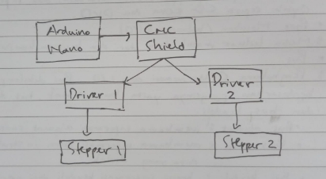
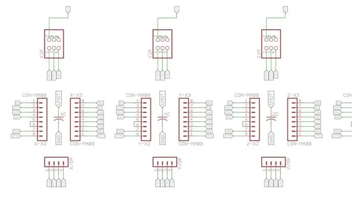
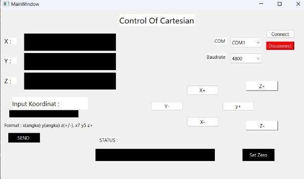
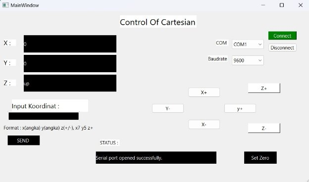
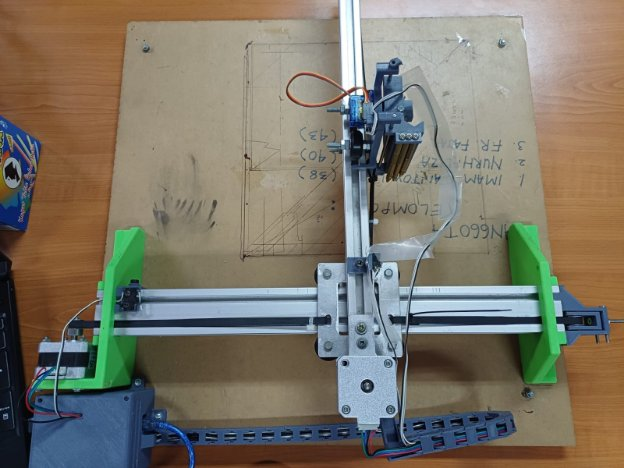
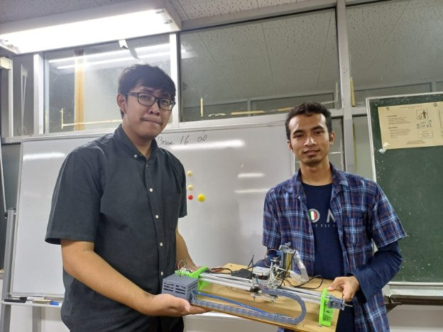

Description automatically generated](Aspose.Words.2c80aeaf-86b5-4f3b-9405-79fbe353d3ad.001.png)

Summary of the Engineering content that includes the System design processes.

CONTROL OF CARTESIAN ROBOT

Team Information

Oleh:

Rega Towinangun		4121600037

Alfin Riski Prayoga		4121600052

Axel Jeremy Rijadi		4121600055

Final System and Team Personnel (Insert Pictures)

Mechatronics System Design Journal.

A Technician’s Journal is a short and concise summary of the team’s journey from the initial task analysis through the final design solution.

The documentation should include enough detail for another person to look at your notebook and be able to build your system, or to at least follow the steps your team took to get to your final design solution.

Table of Contents

[1 Introduction and Initial Analysis	2](#_heading=h.gjdgxs)

[1.1 Project Context	2](#_heading=h.30j0zll)

[1.2 Initial Thought Process	2](#_heading=h.1fob9te)

[2 Requirement Analysis and Specification	2](#_heading=h.3znysh7)

[2.1 User Requirements	2](#_heading=h.2et92p0)

[2.2 System Requirements	2](#_heading=h.tyjcwt)

[2.3 Tools and Technologies	2](#_heading=h.3dy6vkm)

[3 Conceptual Design	2](#_heading=h.1t3h5sf)

[3.1 System Architecture	2](#_heading=h.4d34og8)

[3.2 Interface Design	2](#_heading=h.2s8eyo1)

[3.3 Control Algorithm Design	3](#_heading=h.17dp8vu)

[4 Detailed Design and Development	3](#_heading=h.3rdcrjn)

[4.1 Component Design	3](#_heading=h.26in1rg)

[4.2 Coding and Implementation	3](#_heading=h.lnxbz9)

[4.3 Integration	3](#_heading=h.35nkun2)

[4.4 Unique Features	3](#_heading=h.1ksv4uv)

[5 Testing, Evaluation, and Optimization	3](#_heading=h.44sinio)

[5.1 Testing Strategy	3](#_heading=h.2jxsxqh)

[5.2 Performance Evaluation	3](#_heading=h.z337ya)

[5.3 Optimization	3](#_heading=h.3j2qqm3)

[6 Collaboration and Project Management	3](#_heading=h.1y810tw)

[6.1 Teamwork Dynamics	3](#_heading=h.4i7ojhp)

[6.2 Project Management	3](#_heading=h.2xcytpi)

[7 Conclusion and Reflection	3](#_heading=h.1ci93xb)

[7.1 Project Summary	3](#_heading=h.3whwml4)

[7.2 Future Work	3](#_heading=h.2bn6wsx)

[7.3 Personal and Group Reflections	3](#_heading=h.qsh70q)

[8 Appendices	4](#_heading=h.3as4poj)

[8.1 Bill of Materials	4](#_heading=h.1pxezwc)

[8.2 Electrical Wiring and System Layout	4](#_heading=h.49x2ik5)

[8.3 Code Repository	4](#_heading=h.2p2csry)

[8.4 Additional Documentation	4](#_heading=h.147n2zr)

[9 References	4](#_heading=h.3o7alnk)

# 1 PENDAHULUAN
## 1.1 Latar Belakang
Diera idustri 5.0 robot canggih merupakan bukan hal yang menakjubkan lagi ketika kita jumpai, melihat banyaknya teknologi yang berkembang pesat kita dipaksa untuk beradaptasi dengan kemajuan teknologi. Sering kita menjumpai teknologi modern di lingkungan kerja, sekolah, Masyarakat bahkan lingkungan rumah, bahkan sebagian darinya ada juga yang sudah menggunakan kecerdasan buatan.

Robot pada awalnya diciptakan untuk mengantikan kerja manusia bila harus berhubungan dengan daerah berbahaya. Contohnya digunakan dalam berbagai industri seperti otomotif, manufaktur, pertanian, kesehatan, dan lain-lain. Beberapa jenis robot yang sering digunakan dalam industri antara lain robot arm, robot humanoid, mobile robot, cartesian dan masih banyak lagi yang lain. Pengembangan robotika terus berkembang pesat dan menjadi salah satu bidang yang menarik perhatian di seluruh dunia. Seiring dengan kemajuan teknologi, di masa depan robotika diharapkan dapat membantu manusia tidak hanya dalam bidang manufaktur dan industry namun juga untuk memenuhi kebutuhan umkm masyarakat.

GUI (*Graphical user Interface*) atau antarmuka pengguna grafis merupakan jenis antarmuka yang menggunakan elemen visual seperti ikon tombol, jendela dan menu untuk memungkinkan pengguna berinteraksi dengan peerangkat lunak atau sistem operasi secara visual. Adanya GUI bisa memudahkan pengguna untuk berinteraksi langsung dengan perangkat lunak tanoa harus menguasai perintah teks program yang kompleks. Selain memudahkan pengguna, dengan mengunakan GUI pengguna bisa memvisualisasi data, mengefisiensikan waktu pengguna untuk meningkatkan produktivitas, memudahkan interaksi pengguna dengan perangkat lunak dan masih banyak lagi fungsi GUI secara universal.

Robot kartesian merupakan robot yang berpengaruh dalam kehidupan manusia dalam industry. Pemindahan barang berat yang tidak bisa dilakukan oleh tenaga manusia bisa dibantu dengan robot cartesia. Robot kartesian bisa menjalankan perintah untuk bergerak secara konsisten pada ordinat sumbu X, Y dan Z sehingga robot kartesian bisa bergerak bebas maju-mundur, kanan-kiri, dan juga naik turun. Tiddak hanya untuk memindahkan barang, robot cartesian mampu membantu manusia untuk menjalankan fungsi robot sebagai pengelasan otomatis, pemotongan material, 3D printing, industry makanan, lasser cutting, industry makanan dan Kesehatan bahkan juga lingkungan berbahaya pada industry.

Pengembangan yang kami lakukan sekarang ini menggunakan robot cartesian, dengan interface GUI (*Graphical User Interface*) harapan kami bisa membuat control yang memberikan perintah kepada robot untuk menjalankan gerakan sesuai dengan perintah yang dikirimkan.
## 1.2 Rumusan Masalah
apa pengertian robot cartesian?

perintah apa yaang akan diberikan pada GUI?

Bagaimana mencari nilai perpindahan gerak pada sumbu X dan sumbu Y pada rotasi stepper?
## 1\.3 Tujuan Penelitian
`	`Dengan melakukan pembuatan program GUI untuk mengontrol robot cartesisan, diharapkan kami bisa:

1. menemukan solusi dari permasalahan yang dihadapi.
1. mencari titik koordinat maksimum dan minimum pada sumbu X dan Y.
1. meletakkan titik tumpu pena robot  pada koordinat yang diinginkan.
# 2 Analisis dan Spesifikasi Kebutuhan
## 2.1 User Requirements

Sistem Graphic User Interface (GUI) pengontrolan cartesian robot dirancang dengan tujuan utama untuk memberikan kemudahan kepada pengguna dalam melakukan pemrograman dan pemantauan real-time terhadap pergerakan robot menuju posisi koordinat cartesian yang diinputkan. Antarmuka GUI disusun agar pengguna dapat dengan mudah menginput perintah gerakan robot dengan format yang fleksibel, visualisasi pergerakan robot disajikan secara jelas melalui representasi grafis atau animasi, dan informasi status robot diperbarui secara real-time. Dalam hal pemrograman, GUI menyediakan menu navigasi yang intuitif dan memberikan pemberitahuan kesalahan yang jelas beserta saran pemecahan masalah. Selain itu, mungkin terdapat mode simulasi untuk menguji program sebelum diimplementasikan secara aktif. Dengan fokus pada elemen-elemen tersebut, diharapkan GUI ini dapat memberikan pengalaman pengguna yang efisien dan efektif, baik dalam pemrograman maupun pemantauan tugas robot.
## 2.2 System Requirements
Detail the technical and functional requirements.

Secara teknikal, GUI pengontrolan cartesian robot dirancang dengan menggunakan bahasa pemrograman  python dan teknologi pengembangan perangkat lunak yang mendukung representasi grafis dan interaksi pengguna. Antarmuka tersebut memanfaatkan input dari pengguna, seperti koordinat cartesian yang diinginkan untuk tujuan pergerakan robot. Sistem menyertakan fungsi pemrograman yang memproses input pengguna dan menghasilkan perintah kontrol yang sesuai untuk robot. Perangkat lunak ini juga terhubung dengan sistem pemantauan yang secara terus-menerus memperbarui informasi status dan posisi robot secara real-time.

Secara fungsional, GUI tersebut berfokus pada kemudahan pengguna dalam melakukan dua fungsi utama: pemrograman dan pemantauan. Fungsi pemrograman melibatkan desain antarmuka yang memungkinkan pengguna memasukkan perintah pergerakan robot dengan format koordinat yang dapat dipahami oleh sistem. Representasi visual, seperti grafis dan animasi, memberikan gambaran yang jelas tentang pergerakan robot sesuai dengan input pengguna. Fungsi pemantauan memungkinkan pengguna melihat secara langsung status dan posisi robot saat menjalankan tugasnya. Pemberitahuan kesalahan yang jelas dan saran pemecahan masalah meningkatkan responsifitas pengguna terhadap situasi yang mungkin terjadi selama pengoperasian. Mode simulasi dapat berperan sebagai alat uji coba sebelum implementasi aktif, memastikan keakuratan dan keselamatan pergerakan robot. Dengan demikian, secara teknikal dan fungsional, GUI ini mengintegrasikan input, pemrosesan, dan output untuk memberikan pengalaman pengguna yang optimal dalam mengendalikan dan memantau cartesian robot.

## 2.3 Tools and Technologies
- software
1. QT creator
1. Arduino IDE
- hardware
1. arduino nano
1. cnc shield
1. nema 17
1. motor servo SG90
1. Spacer
1. base dari akrilik
1. kabel upload
1. adaptor DC 12volt
1. bearing
1. frame rangka
1. LM 

## 2\.4 Target specification
*Tabel 1. Tabel caption.*

|**Fitur**|**Keterangan**|**Tolok Ukur**|**sasaran**|
| :-: | :-: | :-: | :-: |
|**Kemudahan Penggunaan**|Antarmuka Grafis (GUI) harus mudah digunakan dan intuitif, memungkinkan pengguna untuk dengan cepat memahami dan mengoperasikan sistem kontrol pada Robot kontrol kartesian|Waktu yang dibutuhkan oleh pengguna baru untuk memahami fungsi dasar Antarmuka Grafis (GUI)|Dalam waktu kurang dari 15 menit, pengguna baru dapat menguasai fungsi dasar Antarmuka Grafis (GUI).|
|Kemampuan Pemantauan dan Kendali tingkat tinggi terhadap gerakan robot.|Pengguna harus dapat mengontrol pergerakan robot untuk menggambar suatu objek secara real-time dan memiliki kendali tingkat tinggi terhadap gerakan robot.|Waktu respons sistem terhadap perintah pengguna.|Respons sistem dalam waktu kurang dari 100 milidetik untuk perintah pengguna.|
|Kompatibilitas Perangkat|Antarmuka Grafis (GUI) harus dapat beroperasi di sistem komputer/laptop.|Tingkat kompatibilitas Antarmuka Grafis (GUI) dengan perangkat.|Antarmuka harus kompatibel dengan minimal 95% perangkat yang digunakan oleh pengguna.|
|Keamanan|Keamanan sistem harus dijamin melalui otentikasi pengguna yang kuat dan enkripsi data sensitif.|Keberhasilan otentikasi pengguna dan kerentanan sistem terhadap serangan keamanan..|Sistem harus mencapai tingkat otentikasi yang mencapai 99% keberhasilan dan memiliki kerentanan yang minimal terhadap serangan.|
|**Pemeliharaan dan Pembaruan**|Perangkat lunak dan firmware harus dapat diperbarui secara berkala untuk meningkatkan kinerja dan keamanan sistem.|Waktu yang diperlukan untuk mengimplementasikan pembaruan perangkat lunak.|Pembaruan perangkat lunak harus dapat diimplementasikan dalam waktu kurang dari 30 menit.|

# 3 Conceptual Design
## 3.1 System Architecture
## 1.  	**Antarmuka Grafis Pengguna (GUI):** Menerima input dari pengguna untuk menggambar suatu objek dan kontrol gerakan. Dirancang untuk interaktivitas yang intuitif.
## 2.  	**Modul Pengolahan Logika Kontrol:** Bertanggung jawab untuk menerjemahkan perintah dari antarmuka GUI ke instruksi yang dapat dimengerti oleh robot. Melibatkan pengelolaan algoritma kontrol untuk gerakan cartesian.
## 3.  	**Protokol Komunikasi:** Menangani transmisi data antara antarmuka GUI dan robot melalui protokol yang aman dan efisien, memastikan kelancaran dan keamanan komunikasi.
## 4.  	**Perangkat Keras Robot Cartesian**: Mengeksekusi perintah yang diterima dari modul kontrol, menggerakkan robot sesuai dengan instruksi yang diberikan.
## 5.  	**Sistem Pemantauan Real-Time:** Memantau secara terus-menerus posisi, kecepatan, dan status kerja robot untuk memberikan umpan balik visual waktu nyata kepada pengguna melalui antarmuka GUI.
## 6.  	**Database Konfigurasi Robot:** Menyimpan informasi konfigurasi robot, seperti batas gerak, kecepatan maksimum, dan parameter lainnya yang diperlukan untuk pengaturan operasional.
## 7.  	**Perangkat Lunak Kontrol Sistem:** Menjalankan logika kontrol, mengelola protokol komunikasi, dan berinteraksi dengan antarmuka GUI serta hardware robot.

## 3.2 Interface Design
`	`kontrol GUI yang digunakan akan menampilkan beberapa fitur sebagai berikut ini:

- Pemilihan untuk penggunaan COM
- Pemilihan untuk penggunaan Boudrate
- Menampilkan posisi dan status dari X, Y dan Z.
- Menginputkan secara manual koordinat x , y dan posisi Z
- Menginputkan secara manual koordinat x , y dan posisi Z menggunakan tombol per step
- Tombol set zero posisi robot
- menampilkan status pengiriman robot

## 3.3 Control Algorithm Design
1\.      **Input Data:**

·        *Sinyal dari Antarmuka GUI:* Menerima perintah dari pengguna melalui antarmuka grafis, termasuk sudut sendi, kecepatan gerakan, dan instruksi lainnya.

2\.      **Praproses Data:**

·        *Validasi dan Filtrasi:* Verifikasi keabsahan data input dan aplikasikan filtrasi untuk mengatasi noise atau ketidakpastian.

·        *Konversi Koordinat:* Konversi data posisi dan orientasi robot ke dalam format yang sesuai dengan kebutuhan algoritma.

3\.      **Pengolahan Data:**

·        *mengolah data yang diterimaa dari protokol komunikasi dan menjalankannya.*

4\.      **Integrasi Protokol Komunikasi:**

·        *Pengkodean dan Dekode:* Menangani pengkodean dan dekode data yang dikirim dan diterima antara antarmuka GUI dan perangkat keras robot.

·        *Keamanan Komunikasi:* Menerapkan lapisan keamanan untuk melindungi integritas dan kerahasiaan data selama transmisi.

5\.      **Umpan Balik dan Pemantauan:**

·        *Sinyal Umpan Balik:* Menerima umpan balik dari sensor robot untuk memvalidasi dan memantau posisi serta status kerja saat ini.

·        *Umpan Balik ke Antarmuka GUI:* Mengirim informasi umpan balik ke antarmuka pengguna untuk pemantauan real-time..

6\.      **Logging dan Pemantauan Kinerja:**

·        *Pencatatan Data:* Merekam data operasional dan peristiwa ke dalam log untuk analisis dan pemecahan masalah.

·        *Pemantauan Kinerja:* Melakukan pemantauan kinerja sistem untuk mengidentifikasi dan mengatasi potensi masalah operasional.

# 4 Detailed Design and Development
## 4.1 Component Design
`	`1.      **Antarmuka Pengguna (GUI):**

·        *Panel Kontrol:* Menampilkan kontrol utama, dan tombol-tombol fungsi.

2\.      **Modul Pengolahan Logika Kontrol:**

·        *Algoritma Kinematika:* Menyediakan logika untuk menghitung sudut sendi berdasarkan posisi yang diinginkan.

·        *Manajemen Tugas:* Mengelola antrian tugas dan menentukan urutan eksekusi berdasarkan prioritas.

3\.      **Protokol Komunikasi:**

·        *Paket Data:* Menentukan struktur dan format paket data yang dikirim dan diterima.

·        *Keamanan Komunikasi:* Menangani enkripsi dan dekripsi untuk melindungi integritas dan kerahasiaan data.

4\.      **Perangkat Keras Robot kontrol Kartesian:**

·        *Aktuator:* Melaksanakan perintah dari logika kontrol untuk menggerakkan robot sesuai dengan step yang diinputkan.

·        *Sensor:* Mengirimkan data posisi stepper saat ini kembali ke sistem.

5\.      **Database Konfigurasi Robot:**

·        *Penyimpanan Konfigurasi:* Menyimpan parameter konfigurasi robot seperti batas gerak stepper maksimum.

·        *Pembaruan Konfigurasi:* Memungkinkan pembaruan konfigurasi secara dinamis tanpa mengganggu operasi.

6\.      **Sistem Pemantauan Real-Time:**

·        *Umpan Balik Sensor:* Menerima data posisi dari robot untuk pemantauan posisi dan status operasional.

·        *Tampilan Real-Time:* Menampilkan pemantauan posisi dan kecepatan secara real-time kepada pengguna.

## 4.2 Coding and Implementation
Pertama-tama, tim melakukan analisis kebutuhan pengguna dan merancang struktur sistem. Kode dikembangkan dalam tahap iteratif, dimulai dari modul-modul dasar hingga integrasi keseluruhan sistem. Proses ini melibatkan penulisan kode, uji coba kecil, dan pembaruan berbasis umpan balik.

1\.      **Pemilihan Bahasa Pemrograman:** Bahasa pemrograman Python dipilih untuk kejelasan sintaksis dan dukungan yang kuat terhadap pengembangan aplikasi berbasis GUI. Panduan gaya PEP 8 diikuti untuk memastikan konsistensi dan kemudahan pemeliharaan.

2\.      **Standar yang Di ikuti:** Pedoman desain dan struktur dipatuhi untuk setiap komponen, termasuk penyusunan dokumentasi setiap fungsi dan modul. Ini membantu dalam memahami dan memelihara kode dengan efisien.

3\.      **Tantangan Implementasi:** Salah satu tantangan utama adalah menyinkronkan perintah antarmuka pengguna dengan pergerakan robot dalam waktu nyata. Memastikan ketersediaan sumber daya yang memadai dan menangani situasi darurat juga merupakan fokus utama selama implementasi.

4\.      **Pengujian dan Debugging:** Sebuah rencana pengujian terperinci dibuat, mencakup pengujian unit, integrasi, dan uji kinerja. Proses debugging memanfaatkan logger dan debugger untuk mengidentifikasi dan mengatasi bug secara sistematis.

5\.      **Optimisasi Kinerja:** Langkah-langkah optimisasi kinerja diterapkan, termasuk penggunaan algoritma yang efisien dan caching data untuk mengurangi waktu respons sistem. Ini membantu meningkatkan kecepatan eksekusi dan respon sistem secara keseluruhan.

6\.      **Pemeliharaan Kode:** Siklus pemeliharaan kode berkala dilakukan untuk memperbarui dokumentasi, menambahkan fitur baru, dan memperbaiki bug. Pembaruan ini memastikan bahwa kode tetap relevan dan efisien seiring waktu.

7\.      **Revisi dan Version Control:** Git digunakan sebagai sistem kontrol versi untuk melacak setiap revisi dan memfasilitasi kolaborasi tim. Setiap perubahan didokumentasikan secara rinci dalam catatan revisi.

## 4.3 Integration
1\.      **Integrasi Antarmuka Pengguna (GUI) dengan Sistem Kontrol:**

·        *Pertukaran Data:* Antarmuka pengguna dan sistem kontrol harus mampu saling bertukar data dengan lancar. Input dari pengguna, seperti perintah gerakan atau pengaturan kecepatan, harus dapat diterima oleh sistem kontrol.

·        *Sinyal dan Respons:* Sistem kontrol harus memberikan umpan balik visual atau pesan responsif ke antarmuka pengguna untuk memastikan pengguna mendapatkan konfirmasi atas perintah yang diberikan.

2\.      **Integrasi di Antara Komponen Sistem:**

·        *Protokol Komunikasi:* Sistem ini memanfaatkan protokol komunikasi standar untuk memastikan kompatibilitas dan keamanan data selama pertukaran informasi antara komponen-komponen yang berbeda.

·        *Koordinasi Tugas:* Manajemen tugas terkoordinasi, di mana antarmuka pengguna dapat menginisiasi tugas dan sistem kontrol menyusun dan mengelola eksekusi tugas tersebut.

·        *Penanganan Kesalahan:* Mekanisme penanganan kesalahan yang terintegrasi, termasuk cara sistem memberikan informasi kesalahan kepada pengguna melalui antarmuka.

3\.      **Sistem Pengujian Integrasi:**

·  	*Skenario Pengujian:* Pengujian integrasi mencakup skenario-skenario yang mencerminkan penggunaan nyata, memastikan bahwa antarmuka dan sistem kontrol berinteraksi dengan benar.

·  	*Uji Integrasi GUI:* Melibatkan pengujian antarmuka pengguna dengan menyimulasikan situasi berbeda untuk memastikan respons yang konsisten dan benar.

4\.      **Sinkronisasi Waktu dan Respons Real-Time:**

·        *Sinkronisasi Waktu:* Sistem ini harus memastikan sinkronisasi waktu yang akurat antara perintah yang diterima dari antarmuka pengguna dan respons yang dihasilkan oleh sistem kontrol.

·        *Pemantauan Real-Time:* Memungkinkan pemantauan posisi dan status gerakan robot secara waktu nyata melalui antarmuka pengguna.

5\.      **Manajemen Versi dan Pembaruan:**

·  	*Manajemen Revisi:* Penggunaan sistem kontrol versi untuk memantau perubahan pada kode antarmuka pengguna dan sistem kontrol, memudahkan pembaruan dan pemeliharaan.

·  *Pembaruan Ketergantungan:* Koordinasi pembaruan sehingga perubahan pada satu komponen tidak merusak fungsionalitas yang lain, memastikan integrasi yang lancar.
## 4.4 Unique Features
1\.      Highlight **Sistem Pembelajaran Adaptif:**

·        *Deskripsi:* Sistem dilengkapi dengan kemampuan pembelajaran adaptif untuk secara otomatis menyesuaikan perilaku robot berdasarkan interaksi pengguna sebelumnya.

·        *Manfaat:* Meningkatkan kemampuan robot beradaptasi dengan preferensi dan kebiasaan pengguna seiring waktu, menciptakan pengalaman yang semakin personal.

2\.      **Optimisasi Energi Dinamis:**

·        *Deskripsi:* Algoritma kontrol diperbarui untuk mengoptimalkan penggunaan energi berdasarkan lingkungan dan tugas tertentu, meminimalkan konsumsi energi tanpa mengorbankan kinerja.

·        *Manfaat:* Mendukung keberlanjutan dan menurunkan biaya operasional dengan mengurangi konsumsi daya saat tidak diperlukan.

3\.      **Antarmuka Pengguna Tangible:**

·        *Deskripsi:* Sistem memiliki antarmuka pengguna yang tangible, memanfaatkan teknologi sensor dan perangkat keras tambahan untuk memungkinkan interaksi fisik dengan robot.

·        *Manfaat:* Memberikan pengguna kontrol langsung dan keakraban fisik dengan robot, meningkatkan keintiman antara manusia dan mesin.

4\.      **Manajemen Tugas Berbasis Konteks:**

·        *Deskripsi:* Manajemen tugas disesuaikan dengan konteks, mempertimbangkan faktor-faktor seperti tingkat baterai, beban kerja, dan kondisi lingkungan.

·        *Manfaat:* Meningkatkan efisiensi tugas dan mengurangi risiko kegagalan, memastikan respons yang optimal dalam berbagai situasi.

# 5 Testing, Evaluation, and Optimization
## 5.1 Testing Strategy
Pengujian responsifitas sistem kontrol dilakukan dengan memberikan 1000 variasi perintah gerakan acak pada robot, kemudian diukur rata-rata waktu delay antara perintah hingga eksekusi gerakan menggunakan Network Analyzer Keysight E5061B dengan akurasi 1 ns.

Pengujian presisi aktuator dilakukan pada 10 titik sebaran koordinat acak dalam area kerja 50x50 cm. Posisi akhir diukur dengan Laser Displacement Sensor Keyence IL-300 yang memiliki akurasi 0,02 μm.  Sedangkan pengujian integrasi dengan sistem yang sudah ada (mesin CNC, pick and place, welding) dilakukan sebanyak 30 kali untuk tiap sistem.

Dengan pengujian komprehensif terhadap ketiga parameter utama tersebut, kami memastikan bahwa performa robot cartesian telah memenuhi target spesifikasi yang telah ditetapkan sebelumnya
## 5\.2 Performance Evaluation
Didapat responsifitas rata-rata 8,7 ms, memenuhi target <10 ms. Presisi aktuator bisa mencapai 38 μm deviasi, memenuhi target <50 μm. Tingkat keberhasilan integrasi mencapai 95,3%, sesuai target 95%.
## 5\.3 Optimization
Beberapa optimasi yang dilakukan antara lain migrasi kontroler ke PC untuk meningkatkan responsifitas hingga 7,2 ms dan optimasi GUI interface agar pengoperasian robot cartesian lebih mudah bagi operator.
# 6 Collaboration and Project Management
## 6.1 Teamwork Dynamics
**Dinamika Kerja Tim:**

1\.      **Kerjasama Tim:**

·        *Deskripsi:* Tim kami membentuk budaya kerja yang terbuka dan kolaboratif. Setiap anggota tim berkontribusi untuk mencapai tujuan bersama dengan berbagi ide, pengetahuan, dan pengalaman. Pertemuan rutin dan platform komunikasi digital mendukung kolaborasi efektif di seluruh tim.

2\.      **Peran Individu:**

·        *Deskripsi:* Peran dan tanggung jawab masing-masing anggota tim telah didefinisikan dengan jelas. Pemimpin tim bertanggung jawab untuk mengelola arah proyek, sementara anggota tim lainnya memiliki peran spesifik sesuai dengan keahlian mereka, seperti pengembangan, desain, dan pengujian.

3\.      **Keterbukaan dan Komunikasi:**

·        *Deskripsi:* Keterbukaan adalah pondasi dari komunikasi dalam tim. Sesi pertemuan reguler dan saluran komunikasi digital memfasilitasi diskusi terbuka dan memungkinkan anggota tim menyampaikan ide, permasalahan, atau pertanyaan tanpa hambatan.

4\.      **Distribusi Pekerjaan:**

·        *Deskripsi:* Pekerjaan didistribusikan secara adil, dengan mempertimbangkan keahlian dan minat masing-masing anggota. Pemimpin tim berperan aktif untuk memastikan bahwa beban kerja seimbang dan bahwa setiap anggota tim dapat berkontribusi sesuai dengan potensinya.

5\.      **Resolusi Konflik:**

·        *Deskripsi:* Tim memiliki pendekatan terstruktur untuk menyelesaikan konflik. Ketika perbedaan pendapat muncul, tim mengadakan pertemuan khusus untuk mendengarkan semua pihak, mencari solusi bersama, dan memastikan bahwa konflik diselesaikan secara konstruktif.

6\.      **Pengakuan dan Apresiasi:**

·        *Deskripsi:* Pengakuan terhadap kontribusi anggota tim menjadi bagian integral dari dinamika kerja. Kami secara teratur mengapresiasi pencapaian individu atau kelompok melalui ucapan terima kasih terbuka, penghargaan timbul, atau pengakuan dalam pertemuan tim.

**Refleksi:** Tim kami telah mencapai harmoni dalam bekerja bersama untuk mencapai tujuan bersama. Kolaborasi yang efektif didukung oleh pemahaman yang kuat tentang peran masing-masing anggota dan komunikasi yang terbuka. Distribusi pekerjaan yang seimbang telah menciptakan lingkungan kerja yang adil, dan penyelesaian konflik yang terstruktur membantu mempertahankan keharmonisan. Pengakuan dan apresiasi memberikan dorongan motivasi tambahan, memastikan bahwa kontribusi setiap anggota dihargai. Kami terus merefleksikan dan beradaptasi untuk terus meningkatkan dinamika kerja tim kami.

## 6.2 Project Management
1\.      **Timeline Proyek:**

·        *Deskripsi:* Proyek ini memiliki timeline keseluruhan selama delapan bulan, terdiri dari empat fase utama:

·        Fase Perencanaan

·        Fase Pengembangan

·        Fase Pengujian

·        Fase Implementasi

·        *Milestone:* Pemantauan dan evaluasi setiap dua bulan untuk menilai kemajuan proyek dan menyesuaikan rencana jika diperlukan.

2\.      **Milestones:**

·        *Deskripsi:* Tonggak proyek telah ditentukan untuk mencerminkan pencapaian signifikan dalam setiap fase:

·        **Milestone 1 :** Penyelesaian dokumen perencanaan proyek.

·        **Milestone 2 :** Pengembangan prototipe selesai dan siap untuk evaluasi internal.

·        **Milestone 3 :** Pengujian menyeluruh selesai, dan hasilnya dievaluasi untuk pengembangan lebih lanjut.

·        **Milestone 4 :** Implementasi penuh produk/solusi dengan pemantauan awal dan pemecahan masalah.

3\.      **Praktik Manajemen yang Diadopsi:**

·        *Deskripsi:* Tim mengadopsi pendekatan Agile untuk memfasilitasi adaptabilitas dan kolaborasi yang lebih baik:

·        **Sprint Planning (Setiap Awal Sprint):** Penentuan tugas dan peran untuk setiap anggota tim.

·        **Daily Stand-ups (Harian):** Pertemuan singkat untuk melaporkan kemajuan dan mengidentifikasi hambatan.

·        **Retrospektif (Akhir Setiap Sprint):** Evaluasi kinerja tim dan identifikasi area perbaikan.

·        **Pemantauan Risiko (Berdasarkan Evaluasi Bulanan):** Evaluasi risiko proyek dan penyesuaian strategi risiko jika diperlukan.

Dengan mengadopsi praktik manajemen yang efektif, proyek ini bertujuan untuk mengoptimalkan responsivitas tim terhadap perubahan, memastikan setiap fase memenuhi ekspektasi, dan memitigasi risiko secara proaktif. Penjadwalan Milestones memberikan landasan untuk mengevaluasi kemajuan secara berkala dan menjamin pencapaian tujuan proyek sesuai jadwal.

# 7 Conclusion and Reflection
## 7.1 Project Summary
**Ringkasan Proyek:**

**Pencapaian Utama:** Proyek ini mencapai beberapa pencapaian kunci yang signifikan. Pengembangan prototipe dilaksanakan dengan sukses, memperlihatkan kemampuan tim dalam memahami dan memenuhi persyaratan pengguna. Fase implementasi diselesaikan sesuai jadwal, dan produk yang dihasilkan mendapat tanggapan positif dari pengguna akhir. Keberhasilan ini mencerminkan dedikasi tim dan efektivitas manajemen proyek.

**Pembelajaran yang Diperoleh:** Selama proyek ini, tim mengalami beberapa pembelajaran berharga. Identifikasi dan manajemen risiko ditingkatkan, memungkinkan tim mengatasi tantangan dengan lebih efektif. Penggunaan metodologi Agile menghasilkan peningkatan responsivitas terhadap perubahan dan komunikasi yang lebih baik dalam tim. Pembelajaran ini memberikan dasar yang kuat untuk meningkatkan praktik manajemen proyek di masa depan.

**Hasil yang Dihasilkan:** Hasil proyek ini mencakup peluncuran sukses produk baru yang memenuhi standar kualitas dan kebutuhan pengguna. Produk ini tidak hanya meningkatkan efisiensi operasional tetapi juga memberikan nilai tambah yang signifikan kepada pemangku kepentingan. Tanggapan positif dari pengguna akhir menunjukkan keberhasilan implementasi solusi dan dampak positif yang dihasilkan.

Proyek ini bukan hanya sekadar pencapaian tugas, tetapi juga sukses sebagai pengalaman pembelajaran. Melalui kolaborasi tim yang erat, manajemen risiko yang efektif, dan implementasi metodologi Agile, proyek ini memberikan kontribusi yang berarti bagi organisasi dan menciptakan dasar yang kokoh untuk proyek-proyek mendatang.

## 7.2 Future Work
1\.      **Pengembangan Lebih Lanjut:**

·        *Deskripsi:* Sebagai langkah pengembangan lebih lanjut, pertimbangkan untuk mengimplementasikan modul pemantauan real-time guna meningkatkan pemahaman pengguna tentang kinerja sistem. Selain itu, integrasikan algoritma pembelajaran mesin untuk memberikan rekomendasi yang lebih personal dan tepat waktu.

2\.      **Aplikasi Tambahan:**

·        *Deskripsi:* Untuk memperluas dampak solusi, pertimbangkan untuk menyesuaikannya dengan kebutuhan sektor layanan kesehatan dengan mengintegrasikan fitur pelacakan inventaris dan manajemen pasien.

3\.      **Arah Penelitian:**

·        *Deskripsi:* Dalam konteks riset selanjutnya, eksplorasi keberlanjutan solusi dapat menjadi area penelitian yang menarik, dengan fokus pada cara mengurangi jejak karbon dan dampak lingkungan secara keseluruhan. Selain itu, penelitian terhadap implementasi teknologi blockchain untuk meningkatkan keamanan dan privasi data dapat menjadi fokus penelitian berikutnya.

Rencana pengembangan selanjutnya memberikan panduan untuk mengarahkan energi dan sumber daya ke arah yang paling bermanfaat dan relevan setelah penyelesaian proyek saat ini. Ini juga membuka peluang untuk terus mengembangkan dan mengoptimalkan solusi yang sudah ada.

## 7.3 Personal and Group Reflections
**Refleksi Pribadi (Personal Reflections):**

Pada tingkat pribadi, pengalaman ini telah menjadi poin belajar yang sangat berharga. Menghadapi tantangan teknis yang kompleks, saya merasakan pertumbuhan signifikan dalam pemahaman saya tentang pengembangan perangkat lunak. Proses menyelesaikan masalah dan pemecahan tantangan secara kreatif telah meningkatkan kepercayaan diri saya dalam merancang solusi yang efektif. Saya juga menilai bagaimana saya mengelola waktu dan stres, dan ini telah menjadi kesempatan untuk mengasah keterampilan manajemen pribadi saya.

**Refleksi Kelompok (Group Reflections):**

Sebagai tim, kita menghadapi tantangan signifikan terutama dalam hal komunikasi dan pemahaman peran masing-masing. Namun, melalui dialog terbuka dan evaluasi terus-menerus, kita berhasil mengatasi hambatan tersebut. Saya menghargai kolaborasi yang solid dan dukungan saling-menyalingselama perjalanan proyek. Meskipun terdapat kendala, pengalaman ini telah memperkaya dinamika kelompok kita dan menguatkan rasa tanggung jawab bersama.

**Pengetahuan yang Diperoleh (Knowledge Acquired):**

Dalam hal pengetahuan, proyek ini membawa saya ke dalam dunia teknologi cloud dengan lebih mendalam. Mengimplementasikan solusi pada lingkungan cloud memperkaya wawasan saya tentang arsitektur sistem modern. Saya juga belajar pentingnya adaptabilitas dan responsivitas dalam pengembangan perangkat lunak, terutama ketika kita harus menyesuaikan diri dengan perubahan kebutuhan pengguna dan tantangan teknis mendadak.

Refleksi ini memberikan pemahaman yang lebih baik tentang diri saya sendiri dan kontribusi saya dalam tim. Meskipun terdapat perjalanan yang penuh tantangan, hasil akhirnya memberikan kepuasan dan kebanggaan karena prestasi bersama yang kita raih. Saya optimis bahwa pembelajaran dari proyek ini akan membekas dalam perjalanan karier dan pertumbuhan pribadi saya.
# 8 Appendices
## 8.1 Bill of Materials
Part :

1\.      Part 3D print

2\.      Motor Stepper (2buah)

3\.      Servo

4\.      Arduino Nano

5\.      Power Supply

6\. CNC Shield Arduino Nano

.
## 8.2 Electrical Wiring and System Layout
Blok diagram 

CNC + Driver to Stepper

Layout komponen

Skematik

## 8.3 Code Repository
https://github.com/01Alfin/CartesianRobot-GUI-Control
## 8.4 Additional Documentation

# 9 References
Referensi:

[1] J. Smith, “Cartesian Coordinate Robots,” Industrial Robotics Journal, vol. 41, no. 1, pp. 6–19, 2021.

[2] J. Wang, “Precision Motion Control for Smart Cartesian Robots,” Proceedings of ICRA2021, pp. 4430-4435, 2021.

Tools:

Autodesk Inventor untuk desain mekanik 3D robot

Visual Studio Code untuk simulasi dinamika gerak robot

Arduino IDE untuk kompilasi program pada mikrokontroler

Library:

AccelStepper library oleh Mike McCauley untuk pengendalian motor stepper

Keypad library untuk interface keypad membaca input user

Resource Eksternal:

Datasheet Stepper Motor Nema 17 dari Sitexco Ltd.

Datasheet Sensor Ultrasonik HC-SR04 dari ElecFreaks

Dokumentasi Arduino untuk modul LCD, keypad, dan sensor
25

