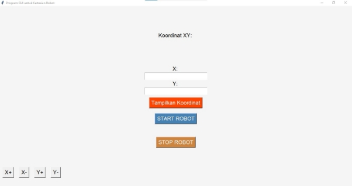

TUGAS PEMROGRAMAN SISTEM MEKATRONIKA

Manual Book GUI

Oleh : 

Riswanda Nuruddin Farij 				(4121600011)

Alief Noer Achmad 					(4121600022)

Alifianto Fahmi Syahputra 				(4121600023)

Program Studi Teknik Mekatronika

Departemen Mekanika dan Energi

Politeknik Elektronika Negeri Surabaya

2023

Langkah-langkah manual book daru GUI Cartesian Robot

1. Memasukkan nilai koordinat X dan koordinat Y.
1. Kemudian Klik tombol tampilkan koordinat sehingga nilai koordinat akan muncul di bagian atas yaitu koordinat XY.
1. Tekan tombol Start Robot untuk memulai pergerakan dari robot cartesian sesuai koordinat XY yang diinputkan.
1. Tombol X+ untuk menggerakkan robot ke sumbu positif X.
1. Tombol X- untuk menggerakkan robot ke sumbu negatif X.
1. Tombol Y+ untuk menggerakkan robot ke sumbu positif Y.
1. Tombol Y- untuk menggerakkan robot ke sumbu negatif Y.
1. Tekan tombol Stop Robot untuk Menghentikan pergerakan robot cartesian.
