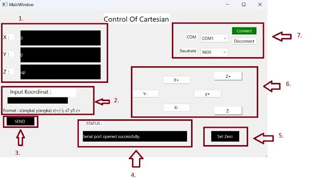

Manual Book 

Control Of Cartesian

*Gambar GUI Control of Cartesian*

**Penjelasan :**

1. Display Koordinat : Menampilkan posisi motor stepper (x), motor stepper (y), dan servo (Z) 
1. Tabel Input Koordinat : Menuliskan koordinat motor stepper x dan y serta posisi servo 
1. Tombol Input Koordinat : Mengirim koordinat x, y, dan z yang diinginkan pengguna
1. Status Bar : Menampilkan pesan apakah perintah terlaksana atau tidak saat penggunaan GUI.
1. Set Zero : Menetapkan posisi koordinat x dan y menjadi 0
1. Tombol Manual : Menggerakkan motor stepper x dan y serta servo secara manual
1. Port & Baudrate setting : Memilih port yang ingin dihubung serta baudrate yang ingin digunakan 

**Cara Kerja :** 

1. Pertama, pilih COM dan baudrate yang dibutuhkan. Kemudian tekan tombol connect untuk mengkoneksikan GUI dengan Robot Control Of Cartesian
1. Setelah terkoneksi, terdapat pesan pada Status Bar serta muncul posisi koordinat x, y, dan posisi z
1. Tulis koordinat x dan y serta posisi z yang diinginkan pada Tabel Input Koordinat dengan format yang tertera
1. Tekan Tombol Input Koordinat untuk mengirim perintah yang sudah ditulis pada Tabel Input Koordinat
1. Setelah itu, pada Status Bar akan tertampil pesan yang menyatakan perintah terkirim jika format ditulis dengan benar serta terjadi perubahan posisi pada Display Koordinat
1. Kemudian untuk penggunaan Tombol Manual dapat menekan setiap tombol untuk menggerakkan motor stepper dan servo. X+ digunakan untuk menggerakkan motor stepper x bergerak per step berlawanan arah jarum jam, X- digunakan untuk menggerakkan motor stepper x bergerak per step searah jarum jam. Begitu juga dengan Y+ dan Y- serta tombol Z+ untuk mengangkat servo dan Z- untuk menurunkan servo.
1. Terakhir, Set Zero ditekan untuk menetapkan posisi x dan y saat itu menjadi 0

